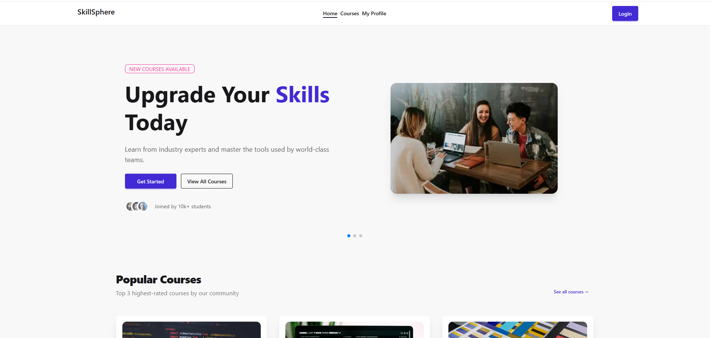

# NexLearn

### *Your Gateway to Skill-Based Learning*

[](https://nextjs.org/)
[](https://tailwindcss.com/)
[](https://better-auth.com/)

**[Live Demo](https://nexlearn-livid.vercel.app/)** · **[Repository](https://github.com/nahin113/NexLearn)**





---

## Overview

**NexLearn** is a modern, full featured online learning platform built with Next.js 15 App Router. It empowers learners to discover, explore, and enroll in skill based courses spanning Web Development, UI/UX Design, Digital Marketing, and more all from a beautifully crafted, fully responsive interface.

Whether you're an absolute beginner or looking to level up your expertise, NexLearn connects you with top instructors and structured curricula to help you grow at your own pace.

---

## Key Features

• **Dynamic Hero Slider** - Smooth Swiper.js-powered banner with course highlights and CTAs
• **Course Catalog** - Browse all available courses with category filters and real-time search by title
• **Search Functionality** - Instantly find courses by name on the All Courses page
• **Popular Courses** - Home page spotlights the top 3 highest-rated courses
• **Protected Course Details** - Full curriculum and details accessible only to authenticated users
• **Authentication** - Secure login & registration with Email/Password + Google OAuth via BetterAuth
• **My Profile Page** - View and update your display name and profile photo
• **Top Instructors Section** - Showcases featured course instructors
• **Learning Tips Section** - Study techniques and time management advice
• **Toast Notifications** - Real-time feedback for all user actions
• **Fully Responsive** - Optimized for mobile, tablet, and desktop
• **Loading Indicators** - Skeleton loaders during data fetches
• **Custom 404 Page** - Friendly not-found experience for invalid routes

---

## Tech Stack

| Category | Technology |
|---|---|
| **Framework** | [Next.js 15](https://nextjs.org/) (App Router) |
| **Styling** | [Tailwind CSS v4](https://tailwindcss.com/) |
| **UI Components** | [DaisyUI](https://daisyui.com/) 
| **Authentication** | [BetterAuth](https://better-auth.com/) |
| **Slider** | [Swiper.js](https://swiperjs.com/) |
| **Deployment** | [Vercel](https://vercel.com/) |

---

## NPM Packages

| Package | Purpose |
|---|---|
| `next` | Core React framework with App Router |
| `react` / `react-dom` | UI rendering |
| `tailwindcss` | Utility-first CSS styling |
| `daisyui` | Pre-built Tailwind UI component library |
| `@heroui/react` | Additional modern UI components |
| `better-auth` | Authentication (Email/Password + Google OAuth) |
| `swiper` | Hero section image carousel/slider |
| `react-hot-toast` | Toast notifications |
| `react-icons` | Icon library (social links, UI icons) |

---

## Project Structure

```
nexlearn/
├── app/
│   ├── (main)/
│   │   ├── page.jsx              # Home page
│   │   ├── courses/
│   │   │   ├── page.jsx          # All Courses
│   │   │   └── [id]/page.jsx     # Course Details (Protected)
│   │   ├── my-profile/
│   │   │   ├── page.jsx          # Profile page
│   │   │   └── update/page.jsx   # Update profile info
│   │   └── layout.jsx            # Main layout (Navbar + Footer)
│   ├── login/page.jsx
│   ├── register/page.jsx
│   └── not-found.jsx
├── components/
│   ├── Navbar.jsx
│   ├── Footer.jsx
│   ├── CourseCard.jsx
│   ├── HeroSlider.jsx
│   └── ...
├── data/
│   └── courses.json              # Static course data
├── lib/
│   └── auth.js                   # BetterAuth config
├── public/
└── .env.local                    # Environment variables
```

---

## Environment Variables

Create a `.env` file in the root directory and populate it with the following:

```env
# BetterAuth
BETTER_AUTH_SECRET=your_better_auth_secret
BETTER_AUTH_URL=http://localhost:3000

# Google OAuth
GOOGLE_CLIENT_ID=your_google_client_id
GOOGLE_CLIENT_SECRET=your_google_client_secret

# Database (if applicable)
DATABASE_URL=your_database_url
```

>  **Never commit `.env` to version control.** It is included in `.gitignore` by default.

---

## Getting Started

### Prerequisites

- Node.js `v18+`
- npm or yarn

### Installation

```bash
# 1. Clone the repository
git clone https://github.com/nahin113/NexLearn.git

# 2. Navigate to the project directory
cd NexLearn

# 3. Install dependencies
npm install

# 4. Set up environment variables
cp .env.example .env.local
# Fill in your values in .env.local

# 5. Run the development server
npm run dev
```

Open (http://localhost:3000) in your browser to see the app.

---


## Pages & Routes

| Route | Description | Access |
|---|---|---|
| `/` | Home — Hero, Popular Courses, Tips, Instructors | Public |
| `/courses` | All courses with search functionality | Public |
| `/courses/[id]` | Full course details & curriculum | Protected |
| `/my-profile` | View logged-in user profile | Protected |
| `/my-profile/update` | Update name and profile photo | Protected |
| `/login` | Email/Password + Google OAuth login | Public |
| `/register` | User registration form | Public |

---

## Author

**Nahin Ahmed**

[](https://www.linkedin.com/in/nahin-ahmed-bd/)
[](https://github.com/nahin113)
[](https://nahinahmed.vercel.app)

---
